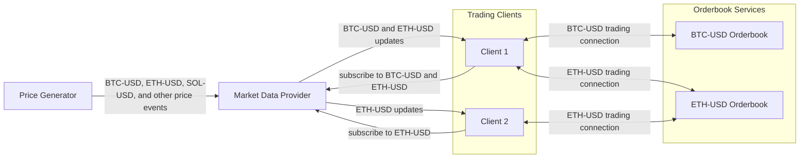

# System architecture

Each rectangle is an independently running service namely:

- 1 Price Generator
- 1 Market Data Provider
- N number of clients
- 5 Orderbooks

The `Price Generator` semi-randomly creates a price for each instrument at some interval. The price is dependent on the previous price with a slight delta and there are upper and lower bounds for each instrument.

Every price update is sent to the `Market Data Provider` through `gRPC`.

Clients are started with a random inventory that they track in-memory and subscribe to price updates from the `Market Data Provider` for their selected instruments. The connection between the provider and client is a single `websocket` where all price updates are sent.

When the provider receives a price update it checks its client subscriptions and forwards the update through the websocket.

When a client receives a price update it makes a decision if it should perform an action on an orderbook for that instrument.

Each orderbook handles 1 instrument and each client has a single `websocket` connection to the orderbook.

The orderbook accepts clients requests after the client has completed a login sequence.

