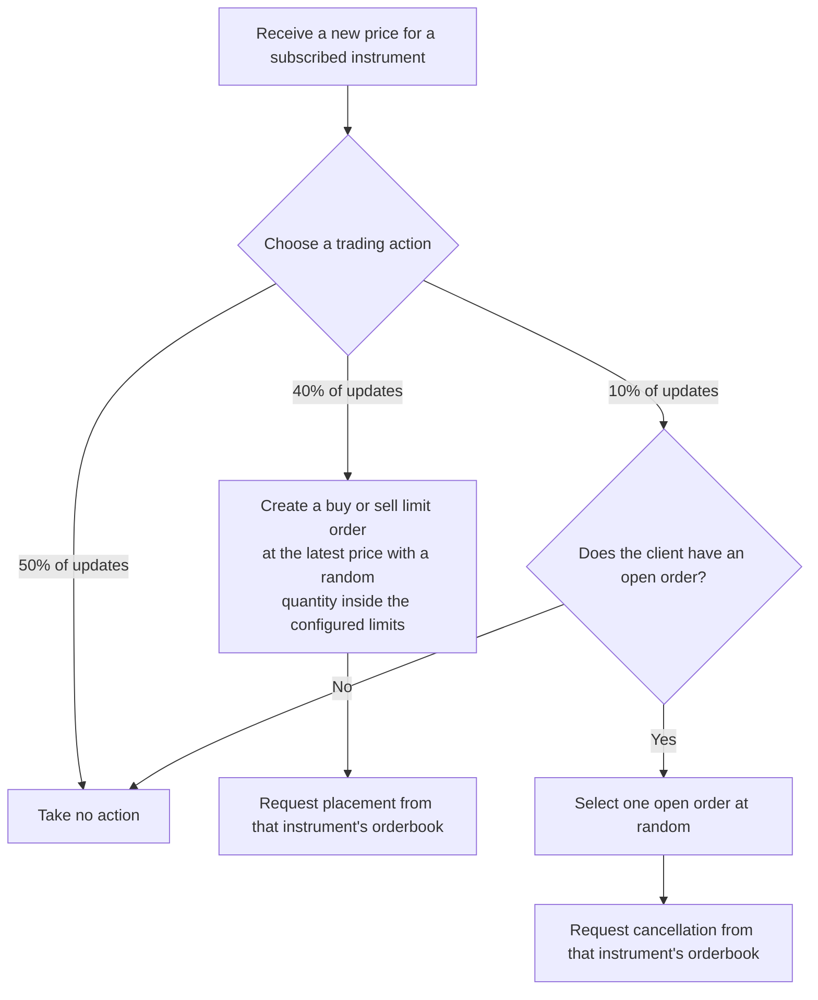
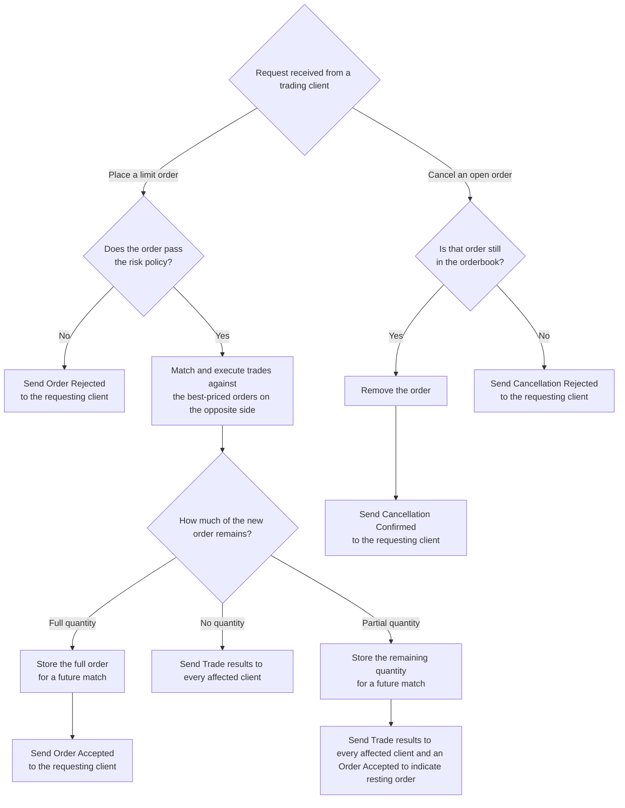

# Decisions

### Client

The client intentionally uses a weighted random choice instead of a trading strategy because strategies are not (currently) implemented.

### Orderbook Service

The orderbook sends an explicit response for every rejection, accepted remainder, trade, or cancellation result.

