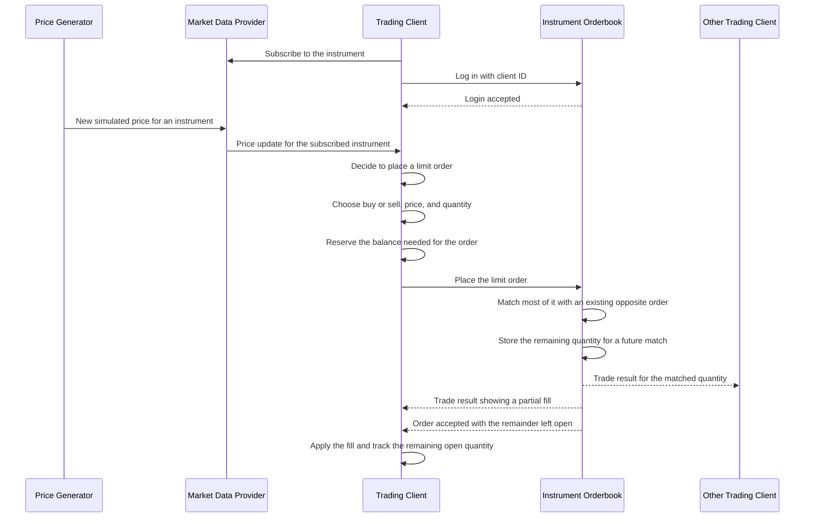
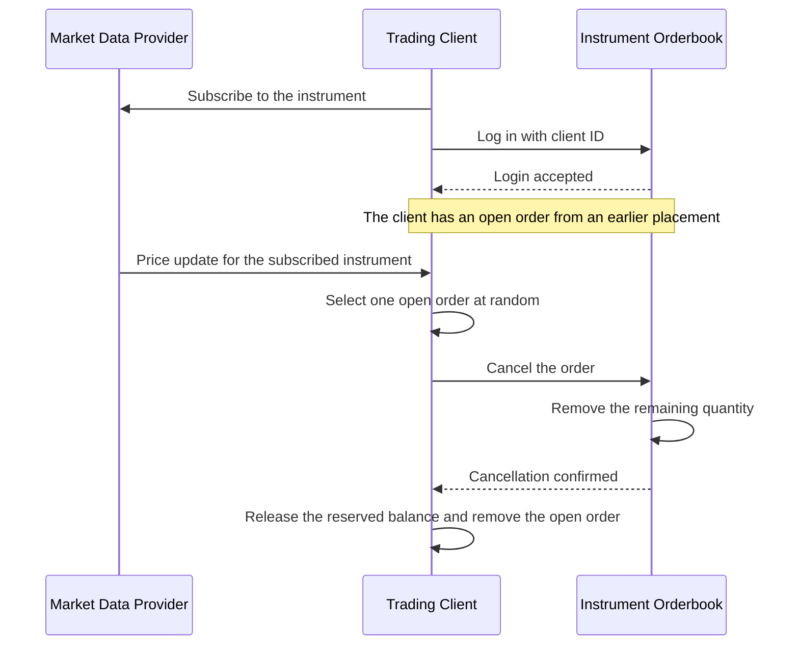
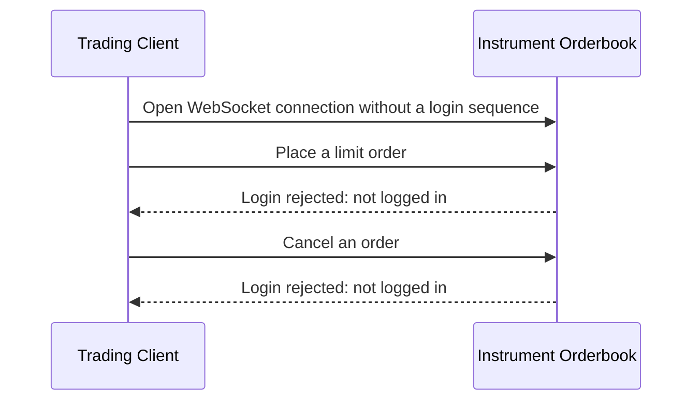

# Sequence Diagrams

## Client order partially filled

After a client has subscribed to price updates from the `Market Data Provider` and completed the login sequence in an `Orderbook`, an incoming price event causes the client to place an order which is partially traded against existing orders and the unfilled/remainder of the order is added to the orderbook for future trades.

In the case where an order is fully traded there is nothing to add to the book, whereas if no trades occur the full order is added.

## Client successfully cancels an existing order

When a price event comes in a client may choose to cancel an existing order at random to free up some of its inventory for other trades.

## Client requests are rejected before login

An orderbook connection does not accept trading requests until the client has successfully logged in. Placement and cancellation attempts both receive the same not-logged-in response.

