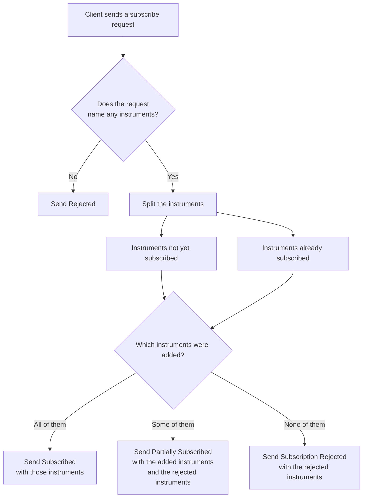
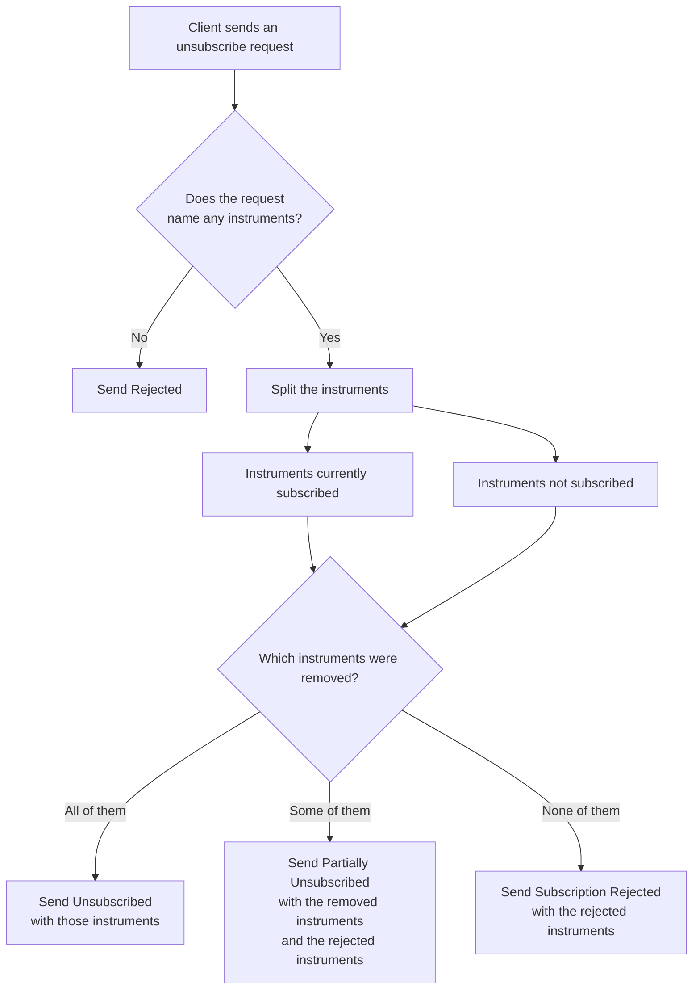
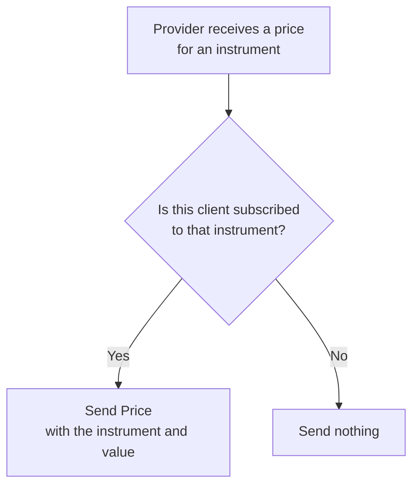

# Subscriptions

## Market data provider

One WebSocket carries subscription changes and price updates.

### Subscribe

The client sends the instruments it wants prices for. An instrument already in that client's subscription is rejected and every other instrument is added. The client is informed about the result of all instruments.

### Unsubscribe

The client sends the instruments it no longer wants. An instrument that is not in that client's subscription is rejected and every other instrument is removed. The client is informed about the result of all instruments.

### Price update

When the price generator sends an update for an instrument the provider checks which clients should receive the update.

> Note: All connected clients receive updates through 1 price channel and filter based on instrument subscriptions. This is fine but at larger scales (more instruments, more clients) we'd lean toward 1 cache containing the latest price per instrument with a TTL and when a client is connected to a gateway and subscribed to some instrument it would receive those events.

